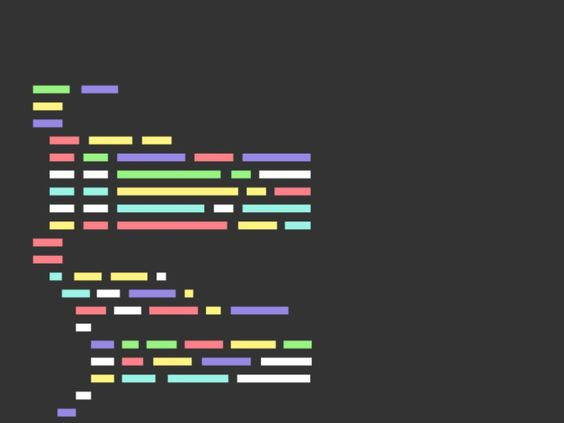

# Welcome to My Code wars Solutions 👋

This repository contains my solutions to some of the fun and challenging problems from [Code wars](https://www.codewars.com/), a platform for honing and testing your coding skills.

## What's inside this repository? 📚

You can browse the solutions by difficulty level (kyu). Each solution has a link to the original problem statement, a brief explanation of the approach and the code in Rust.

## Why did I create this repository? 

These solutions are not intended to be the best or the most optimal ones. They are just my personal attempts to solve the problems. You may find better or more elegant solutions elsewhere. I encourage you to try to solve the problems on your own before looking at the solutions.

This repository was created as part of my learning journey with Rust, a modern and powerful programming language. I hope it can help other people who are interested in Rust and coding challenges.

**You can also send me your solutions in Rust if you want to share your ideas and learn from each other.**

## How can you contact me? 📧

If you have any feedback, suggestions or questions about this repository, feel free to contact me at firapinch@gmail.com. I would love to hear from you!
